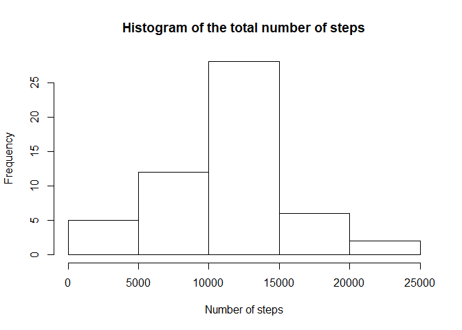
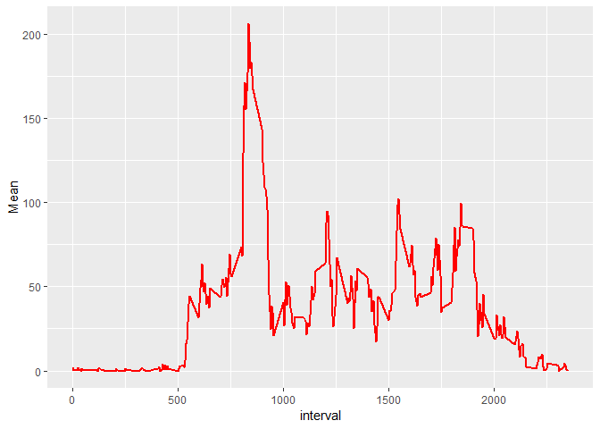
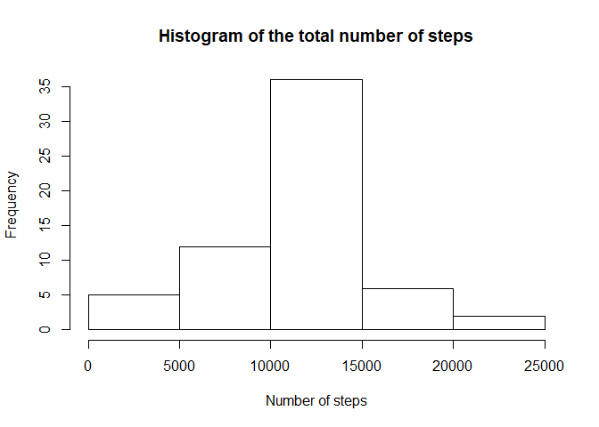
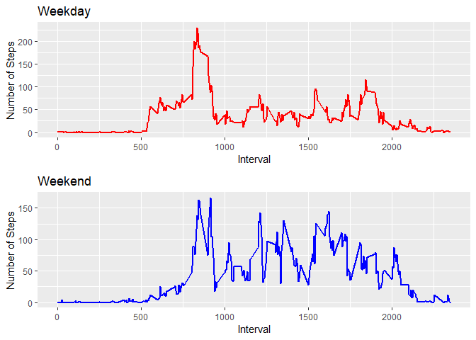

## Loading and preprocessing the data


```r
library(dplyr) 
```

```
## 
## Attaching package: 'dplyr'
```

```
## The following objects are masked from 'package:stats':
## 
##     filter, lag
```

```
## The following objects are masked from 'package:base':
## 
##     intersect, setdiff, setequal, union
```

```r
#setwd("RepData_PeerAssessment1")
unzip("activity.zip")
data <- read.csv("activity.csv")
data <- mutate(data, date = as.Date(date))
```

## What is mean total number of steps taken per day?


```r
library(ggplot2)
by_day <- group_by(data,date)
summarise_sum <- by_day %>% summarise(Sum = sum(steps))

hist(summarise_sum$Sum,main = "Histogram of the total number of steps", xlab = "Number of steps")
```

<!-- -->

```r
m1 <-mean(summarise_sum$Sum, na.rm = TRUE)
m2 <-median(summarise_sum$Sum, na.rm = TRUE)
```

The mean of the total number of steps taken per day is **1.0766189\times 10^{4}** and the median is **10765** .

## What is the average daily activity pattern?


```r
by_interval <- group_by(data,interval)
summarise_mean <- by_interval %>% summarise ( Mean = mean(steps,na.rm = TRUE))

g <- ggplot(summarise_mean,aes(interval,Mean)) +geom_line(color = "red", size = 1)
g
```

<!-- -->

```r
max <- which.max(summarise_mean$Mean)
int <- summarise_mean$interval[max]
```
The 5-minute interval that contains the maximum number of steps is **835**.

## Imputing missing values

```r
isna <- sapply(data$steps,is.na)
totalna <- sum(isna)
total <- length(data$steps)
percent <- totalna/total *100
```
The total number of missing values is **2304** out of 17568 ( 13.1147541 %).


The strategy i used to fill the missing values is the mean for that 5-minute interval.

```r
olddata <- data #Saving the original dataset

#Fill in the missing values

for (i in 1:total){
    if (is.na(data$steps[i])){
        interval <- data$interval[i]
        index <- match(interval,summarise_mean$interval)
        data$steps[i]<- summarise_mean$Mean[index]
    }
}
```


```r
by_day <- group_by(data,date)
summarise_sum <- by_day %>% summarise(Sum = sum(steps))

hist(summarise_sum$Sum,main = "Histogram of the total number of steps", xlab = "Number of steps")
```

<!-- -->

```r
m1 <-mean(summarise_sum$Sum, na.rm = TRUE)
m2 <-median(summarise_sum$Sum, na.rm = TRUE)
```

The **new** mean of the total number of steps taken per day is **1.0766189\times 10^{4}** and the **new** median is **1.0766189\times 10^{4}** .

The values of the histogram and the median differs from the original, but the mean still the same.


## Are there differences in activity patterns between weekdays and weekends?


```r
weekday <- sapply(data$date,weekdays)
data <- data %>% cbind(weekday) %>% mutate( weekend = (weekday == "Saturday"| weekday =="Sunday")*1)

library(gridExtra)
```

```
## 
## Attaching package: 'gridExtra'
```

```
## The following object is masked from 'package:dplyr':
## 
##     combine
```

```r
wkday <- filter(data, weekend == 0)
wkend <- filter(data, weekend == 1)

by_interval <- group_by(wkday,interval)
summarise_mean <- by_interval %>% summarise ( Mean = mean(steps,na.rm = TRUE))

g <- ggplot(summarise_mean,aes(interval,Mean)) +geom_line(color = "red", size = 1) + ggtitle("Weekday") + labs(y="Number of Steps" , x="Interval") 

by_interval <- group_by(wkend,interval)
summarise_mean <- by_interval %>% summarise ( Mean = mean(steps,na.rm = TRUE))

f <- ggplot(summarise_mean,aes(interval,Mean)) +geom_line(color = "blue", size = 1) + ggtitle("Weekend") + labs(y="Number of Steps" , x="Interval") 

grid.arrange(g,f,nrow=2)
```

<!-- -->

